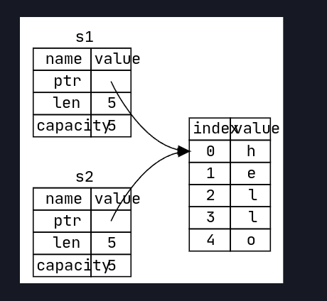

# Ownership-What makes rust unique 

## Stack vs Heap 

The concept of LIFO stands for these stacks, but to push on this stack the size must be known. Data with unknown size that may vary during run time are stored in the heap.

The process of putting things willy nilly (in a space big enuf for your data) is called `allocating`. Pushing onto the stack is NOT allocating. The heap later returns a pointer, who's size is always known and fixed, Thus these pointers can be stored on the stack.

Ok, so that is enuf to understand ownership.

## Rules of ownership

- Each value in Rust has a variable that is its owner.
- Only one owner at a time.
- when owner goes out of scope so does the value.

## Copying stack vs Heap vars 

If a heap var like string : 

## Refrences 

~[img](./2.png)

