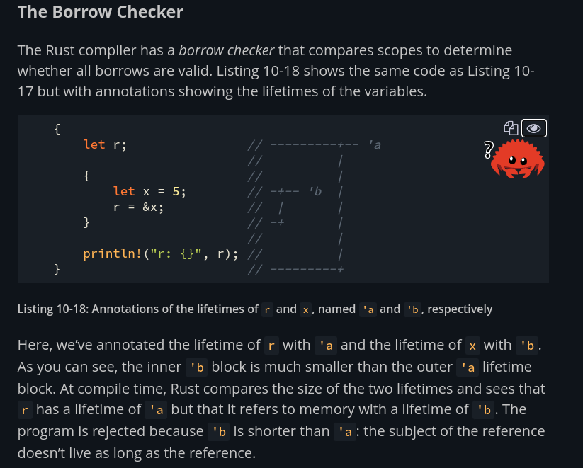
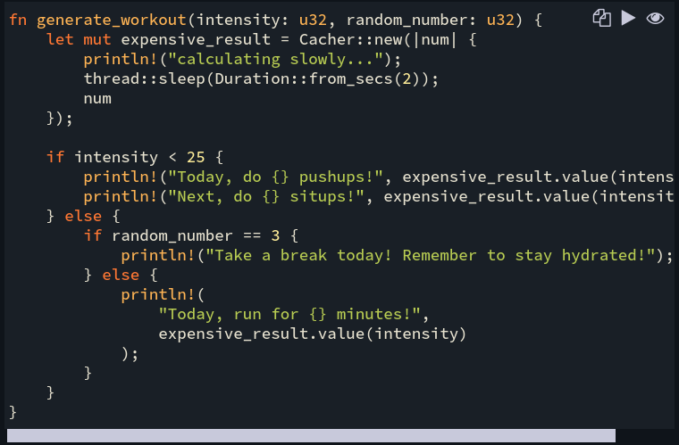
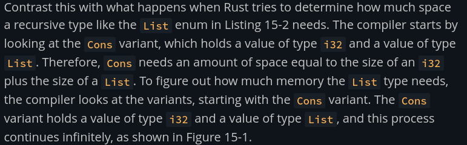
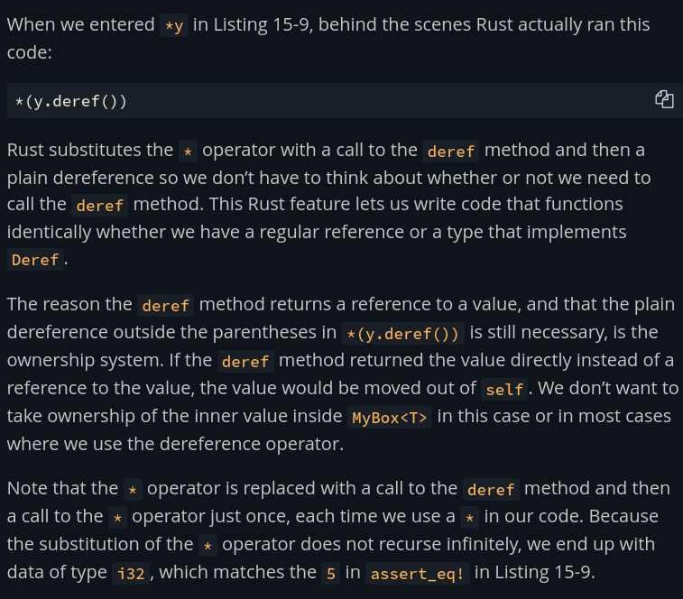

# Ultimate Rust cheat sheet : 

## Tuples  

- let new_tup = ("name_str", 32);
- let (name,age) =  new_tup //destructuring
- new_tup.1 //Dot notation for indexing, indexing start from 0
- Only has debug print trait implemented

## Structs

- Basic syntax for defining a struct : 
```rs
struct Message{
    from: String,
    to: String,
    content: Vec<i32>, //Vector for bytes
    typ: MessageType
}
```
- A struct can be built and is reffered to as creating and "instance", NOTE : To construct a struct you must provide all fields.
```rs
let msg1 = Message{
        from: String::from("Navin"),
        to: String::from("User2"),
        content: vec![72,101,108,108,111,44,32,87,111,114,108,100,33],
        typ: MessageType::Message,
};
```
- fields of a stuct are read using dot notation
- Entire instance must be mutable, individual fields can not be mutable by themselves.
- [Struct Update Syntax] Another instance can be created from existing ones, all new field value must be explicitly mentioned before the ..old_struct, like so : 
.
```
let _msg3 = Message{
        typ: MessageType::File,
        ..msg1 //NOTE : All values of msg1 that do not have copy trait are moved to msg3
    };
    //println!("Messag was sent from {:?} to {:?} with content : {:?}",msg1.from,msg1.to,std::str::from_utf8(&msg1.content).unwrap());//Causes error
```
Be very vary of the move happening in the "Struct Update Syntax", as the name suggests, this must be used for updating a struct not creating new ones.
- Rust also has tuples struct, where the field names are not given:
```rs
struct Color (i32,i32,i32);
struct Coord_3d (i32,i32,i32); //Can destructure and index using . notation
```

The choice if String instead for &str was  a deliberate choice above, this is cus Rust expects a struct to own all it's values. If a struct should store a reference then we need lifetime specifiers which we will see later.

- Structs by themselves do not have debug print trait, and hence needs to be derived using #[devive(Debug)]
> NOTE : Every field of the struct must have the same set of derived traits.
- Struct has have methods closely tied to themselves in Rust, These are called implmentations.

## Enums and Options : The alternative to the billion dollar mistake. How Enums tie it all together.
- Basic enum definition syntax : 
```rs
#[derive(Debug)]
struct Day{
    day_in_words: String,
    date: i32,
    month: i32,
    year: i32
}
#[derive(Debug)]
enum DayType{
    Weekday(Day),
    Weekend(Day)
}

impl DayType{
    fn print_pretty(self: &Self){
        println!("{:#?}",self);
    }
}
```
- Options :
```rs
let x: Option<i32> = Some(31);
let _y = x+34; //Gives error, cant add Option and i32
```
That is hwo rust makes sure that a null reference can never happen, Option is more like indicating that a variable can be of typer None, meaning before you can do any operation on it some check have to be done. If the variable is not of type option is can never be None. 
> Note : None is analougous to NULL is other subject, but ofc better.
- This is where we get `match` to help us, NOTE : match has to be exhaustive at all times or have _ arm. Using match with Options : 
```rs
x = match x{
    None => { 
        println!("Not initiliased");
        None
    },
    Some(x)=>{
        Some(x+31)
    }
}
```
- Using match with above enums : 
```rs
impl DayType{
    fn print_pretty(self: &Self){
        println!("{:#?}",self);
    }
    fn is_tueday(self : &Self){
        match self{
            DayType::Weekday(day)=>{
                if day.day_in_words == "tuesday"
                {
                    println!("It is tueday!");
                }else{
                    println!("It is not tuesday :(");
                }
            },
            _=>println!("It is not tuesday :(")
        } 
    }
}
```
> NOTE : the Enums-03 module is very very well written! refer it.

## Modules  

- Rust only sees the "crate root", that is the main.rs files in binary crate and lib.rs in library crate. Any file that is neeeded to be used must be explicitly added in the module tree. This can be done using the mod keyword, but as said before rust only sees main.rs, hence we use the mod keyword in main.rs file.
- Everything is private in rust, we can make it public.
- If ther exists modules in a folder, the folder must have a mod.rs which define all the modules in the folder and also pub or not.
- Once added in the Module tree, the given module can be accessed from other files using the correct path.
- [best resource for module system](https://www.sheshbabu.com/posts/rust-module-system/)

## Vectors : Allocated in the heap

- let mut vec = Vec::new();
- vec.push(1) //Only a single value
- let mut vec2 = vec!['H','E','L','L','O'];
- vec.len()
- vec[2] //indexble
- vec.get(2) //same as indexing
- let vec_slice = &vec[2..5]; //Slices are ALWAYS refrences, the last index is not included

- vectors are indexable, but instead of using [] and letting the code panic when the element does not exists, we can use .get method that return an Option type (Some() or None). Code : 
```rs
//----------Vectors----------
let mut v1 : Vec<i32> = Vec::new();
let mut v2 = vec![2,4,7];
v1.push(3);
v2.push(3);
v2.pop();
println!("First element : {}",v1[0]); 
println!("First element : {}",v1.get(0).unwrap()); //Safer way of fetching element.
```
This can lead to cleaner code as such : 
```rs
let mut input : String = String::new();
std::io::stdout().write(b"Enter an index to fetch from vector 1 : ").unwrap();
std::io::stdout().flush().unwrap();
std::io::stdin().read_line(&mut input).unwrap();
let input_i32 : usize = match input.trim().parse(){
    Ok(n) => n,
    _=>panic!("Invalid input for index")
};
match v1.get(input_i32){
    Some(n) => println!("Element found : {}",n),
    None => println!("Element not found at that index")
};
```
Incredible piece of code, no?

- You can not have a push operation where there is a refrence (mut or imut) before hand. To make this easier to remember just assume that .push() method takes a mutable reference of vectors to write to it. Simply Rust will not let you modify anything as long as a refernce exists.
```rs
//Works : 
let v1_ref = &v1[0];
v1.push(2);

//Wont work : 
let v1_ref2 = &v1[1];
v1.push(4);
//println!("Printing a refrence that appeared before push : {}",v1_ref2); //Will break code
```
- We can iterate over vectors with mut or imut refrences, like so : 
```rs
for i in &v1{
    println!("Item from v1 : {}",i);
}
for i in &mut v1{
    *i=*i+50;
}
for i in &v1{
    println!("Item from v1 : {}",i);
}
```
- Vectors are sadly homogeneous in Rust (This also is a degin choice to security), but we can still do something like this : 
```rs
#[derive(Debug)]
enum UniversalType{
    Text(String),
    Number(i32),
    Charecter(char),
    Decimal(f64)
}

...

let v3 = vec![UniversalType::Text(String::from("hello")),UniversalType::Number(34)];
println!("from v3 : {:?}",v3.get(1).unwrap());
```

## String
- Can convert from &str to String using .to_string(), ownership is no transffered. Contat using + does transffer ownership depending on refrence of not. Code like so : 
```rs
//----------String-----------
let str1 : &str = "Hello, World!";
let mut string1 : String = str1.to_string();
string1.push_str(&str1); //Take refrence of str1 thus ownership of str1 is maintained.
println!("{}",str1);
let string2 : String = String::from("Hello world, twice!");
let string3 = string2 + &string1; //ownership of string2 is transffered. string1 remains the same.
println!("{}",string3);
```
that thing with + sign is confusing, no? Well in the stad def the code is such that u can add a String with &str, but &string1 is a &String, how does it work then? Rust does something called defer coerce, it converts the &String to &str.
> Notes : You can not add two String (String + String) in rust.
Its this property that makes the usage of + for concat of String very weird, hence the format! macro.
- format macro:
```rs
let temp_str1 = String::from("5");
let temo_str2 = String::from("7");
let string4 : String = format!("{}\"{}\' tall",&temp_str1,&temo_str2);
println!("Your height : {}",string4);
```
- Idexing string using [] is not allowed. Simply put its because Rust doesn’t want us fools accessing a single byte when in some cases utf-8 characters are encoded with 2 bytes. Rust book explains is much better [here](https://doc.rust-lang.org/book/ch08-02-strings.html#indexing-into-strings).
- If you still want to index them, you can make references index or slices, both of which will return raw bytes and have no assurity.


## HashMaps 

- HashMaps by default store a <String,i32> key-value pair, to define anything different : 
```rs
#[derive(Debug)]
struct Data{
    player_id:i32,
    age:i32,
    team:String,
    averagescore:f64
}

let mut data : HashMap<String,Data> = HashMap::new();
data.insert(String::from("Player1"),Data { player_id: 237, age: 23, team: String::from("Team A"), averagescore: 34.7 });
```
- there does not exist a macro to build hashmaps, we must depend on .insert() method. We could also use .collect() method that works on iter, like so:
```rs
let players : Vec<String> = vec![String::from("Player2"),String::from("Player3")];
let player_data : Vec<Data> = vec![Data { player_id: 238, age: 32, team: String::from("Team B"), averagescore: 35.7 },Data { player_id: 238, age: 21, team: String::from("Team A"), averagescore: 42.7 }];
let data_map2 : HashMap<_,_> = players.into_iter().zip(player_data.into_iter()).collect();
println!("{:#?}",data_map2);
```
the HashMap<_,_> is done such that the compier can fill in those values at compile time looking at the right hand side.
- Ownership in hashmaps : is the variables type implements copy trait then it is copies, else moved. Using references will not move the value, but we do need valid lifetime specifiers, which we will see shortly.
- We can access HaspMap values using the two ways just like in vectors : 
```rs
println!("{:#?}",data_map2["Player3"]);
println!("{:#?}",data_map2.get("Player2").unwrap());
```
Using .get we can also do that very nice error handling as the example shown in Vectors section.
- We can simply overwrite key value pairs. If we want to only insert if key doesn’t exist, we can use .entry along with .or_insert(). .entry() return a Enums of type Entry that can differentiate between present and absetn keys, .or_insert() is am impl on type Entry that inserts if key doesn’t exists, like so : 
```rs
data_map2.entry(String::from("Player2")).or_insert(Data { player_id: 400, age: 32, team: String::from("Team B"), averagescore: 35.7 }); //Wont apply
data_map2.entry(String::from("Player1")).or_insert(Data { player_id: 237, age: 23, team: String::from("Team A"), averagescore: 34.7 }); //Will apply
println!("{:#?}",data_map2);
```
> Notes : .entry().or_insert() return back a reference to the value present to the given key.
- Updating values present in HashMaps using refrences (This feels very much like C):
```rs
let mut hash3 : HashMap<String,i32> = HashMap::new();
let text = "she sells sea shells at the sea shore";
for i in text.split_whitespace(){
    let count = hash3.entry(i.to_string()).or_insert(0);
    *count+=1;
}
println!("{:#?}",hash3);
``` 

## Generics : Function overloading alternatives. kind of 

- HGnerics help with function overloading but also restricting methods bassaedon types and traits.

- Generics on functions (We'll get back to this later) : You can not compare any type T unless the type ad the std::cmp::PartialOrd trait is implmented, meaning to compare generic we need that trait.
- Genrics on struct : 
    - For a given struct or fn the T should be the same type everywhere, internally the compiler converts T to its conrete type multiple types if needed, th can be see clealy wwth the given example belo. This means if you possibly wat two different types of generices u need two generics:
```rs
struct Pairs<T>{
    x: T,
    y: T,
}

struct PairsHetro<T,U>{
    x:T,
    y:U,
}

fn main() {
    println!("Hello, world!");
let p1 = Pairs{ x:12,y:23 }; //Works : Implicit definition of T is done by compiler as i32 for p1
    //let p2 : Pairs<T> = { x:23,y:34  }; //Wont work cus main function doesnt know what <T> is
    let p2 : Pairs<i32> = Pairs{ x:23,y:34 }; //Works explicit definition of T
    let p3 = Pairs{ x:2.3,y:23 }; //Wont work;
    let p3 = PairsHetro{x:2.3,y:23}; //Works!

}
```
> Notes : Rust accomplishes this by performing monomorphization of the code using generics at compile time. Monomorphization is the process of turning generic code into specific code by filling in the concrete types that are used when compiled. This way we have 0...absolute 0 speed diff in runtime.
- Generics on enums :
    - Here we can see exaclty how Option enum was defined in std : 
    ```rs
    enum Option<T>{
        Some(T),
        None
    }
    ```
    - And also Result enum from std :
    ```rs
    enum Result<T,E>{
        Ok(T),
        Err(E)
    }
    ```
- Generics on imple, we can ue generic types in impl in very nice ways. You can restrict some method to when geneeic of some particula type. You can also make some methods available to eveything no matter the the generuc turned out be, like so:
```rs
struct PairsHetro<T,U>{
    x:T,
    y:U,
}

use std::fmt::Debug;
impl<T:Debug,U:Debug> PairsHetro<T,U>{ //These methods are available to all T and U that have Debug trait
    fn pretty_print(self:&Self){
    println!(" ({:#?},{:#?}) ",self.x,self.y);
    }
}

impl PairsHetro<i32,f32>{
    fn add2(self:&mut Self){
        self.x+=2;
        self.y+=2.0;
    }
} 

//In all trait check happen on generics going into imp and type checks happen on generics going into
//the object (struct or enu or whatev)

fn main() {

    let p3 = PairsHetro{x:2.3,y:23}; //Works!
    let mut p4 = PairsHetro{x:32,y:3.2};
    //p3.add2(); //Does not work
    p4.add2(); //works
    p3.pretty_print(); //Work 
    p4.pretty_print(); //Works
}
```
> Notes : trait check go into impl generics, type checks go into object generics (strucor enum), see in above example.
- Its not compulsory that them impl methods have to use the same genrics as their objects, they can introduce new generics thenselves, the examples for the book makes this clear, like sso : 
```rs
struct Point<X1, Y1> {
    x: X1,
    y: Y1,
}

impl<X1, Y1> Point<X1, Y1> {
    fn mixup<X2, Y2>(self, other: Point<X2, Y2>) -> Point<X1, Y2> {
        Point {
            x: self.x,
            y: other.y,
        }
    }
}

fn main() {
    let p1 = Point { x: 5, y: 10.4 };
    let p2 = Point { x: "Hello", y: 'c' };

    let p3 = p1.mixup(p2);

    println!("p3.x = {}, p3.y = {}", p3.x, p3.y);
}
``` 

## Traits  
- here we will be able to provide the std::cmp::PartialOrd trait to our generic!
- To define new traits with and witout default : 
```rs
use std::fmt::Debug;
#[derive(Debug)]
struct Coords<T,U>{
    x:T,
    y:U,
}
pub trait RealCoords{
    fn dist_from_origin(self:&Self)->f32; //No default
}

impl RealCoords for Coords<f32,f32>{ //Trait RealCoord is only implemented when T and U are f32
    fn dist_from_origin(self:&Self) ->f32 {
        return f32::from((self.x.powi(2)+self.y.powi(2)).sqrt())    
    }
}
```
> When u try and mix and match trait and type boudns rust goes mad, so lets at the moment consider only one bound at a time.
- With default definitions for trait functions: 
```rs
struct Details<T,U>{
    age : U,
    id : T
}

trait PrettyPrint {
    fn print_pretty(&self){ //with default
        println!("No specific impl of PrettyPrint traitr :(");
    }
}

impl<T,U> PrettyPrint for Coords<T,U>
 where T: Debug,
       U:Debug
{ //Traits bounds with better syntax
    fn print_pretty(&self) {
        println!("( {:#?},{:#?} )",self.x,self.y);
    }
}

impl<T,U> PrettyPrint for Details<T,U>{} //Fills in default
```

- You can also return "any" type that impl a particular trait (You can only return one type from one function)
```rs
fn return_type_with_printprettty_trait(age : i32 , id : i32) -> impl PrettyPrint{
    Details{
        age,
        id
    }
}

```
- To bring all the above codes together: 
```rs
fn main() {
    println!("Hello, world!");
    let coord1 = Coords{x:2.3,y:3.4};
    let coord2 = Coords{x:3,y:4};
    println!("distance : {}",coord1.dist_from_origin());
    coord1.print_pretty();
    //println!("distance : {}",coord2.dist_from_origin()); //doesnt work
    coord2.print_pretty();
    let deet1 = Details{ age:"32",id:"237" };
    deet1.print_pretty();
    let deet2 = return_type_with_printprettty_trait(32,1234);
}
```
- So we had written a generic largest function in the Generics module (its commentd out there), which was a causing a problem that trait T has not implem std::cmp::PartialOrd was not impl, we are not equppied to solve this!


## Lifetime and validating refrences : Not so complete
- Lifetimes are another generic, every reference in rust has its own lifetime. So what is this life times problem, well this really opens my eyes to the flaws is other languages : 
```rs
fn main(){
    let r;
    //r has no value so cant print 
    {
        let x = 5;
        r=&x;
    }
    println!("R : {}",r); //Will give error cus r is refrencing to x whos lifetime/scope was within the inner brackets.
  
}

```
In this case we simply say r lives longer than x.
- The borrow checker 

- First function with explicit life times : 
```rs
/*
 *
 *Doesnt work!
 *fn longest1(x:&str , y:&str) -> &str{
 *    if x.len() > y.len(){
 *        x
 *    }else{
 *        y
 *    }
 *}
 *
 */

fn longest2<'a>(x:&'a str , y:&'a str) -> &'a str{
    //Generic life times simply tell that the returned 
    //value will live for as long as the two inputs
    if x.len() > y.len(){
        x
    }else{
        y
    }
}
```
- Note that by explicitly listing lifetimes we are not changing the lifes of any of the refrences or variables, we are simply and only relating these varaibles using lifetimes.
- Note : We don’t get in trouble as long are returns or any of the variables have life times that re surrounded by larger lifetimes. This doesn’t make much sense does it? Well from the book  : 
> Ver very very very imp Note : When we pass concrete references to longest, the concrete lifetime that is substituted for 'a is the part of the scope of x that overlaps with the scope of y. In other words, the generic lifetime 'a will get the concrete lifetime that is equal to the smaller of the lifetimes of x and y. Because we’ve annotated the returned reference with the same lifetime parameter 'a, the returned reference will also be valid for the length of the smaller of the lifetimes of x and y.
- To warrant the above, here is code examples : 
```rs
 /*
     *Doesnt work
     *let string1 = String::from("long string is long");
     *let result;
     *{
     *    let string2 = String::from("xyz");
     *    result = longest2(string1.as_str(), string2.as_str());
     *}
     *println!("The longest string is {}", result);
     */
    //In above code 'a is replaced with concrete life time of smaller life time that is (string2)
    //but return result has a bigger lifetime and hence causes error.

    //Works : 
    let string1 = String::from("long string is long");
    {
        let string2 = String::from("xyz");
        let result = longest2(string1.as_str(), string2.as_str());
        println!("The longest string is {}", result);
    }
    //Life time of 'a is replaced with that of string2 but return result also has same life time
    //and hence no error and vialotions.
```
- As long as the lifetime of the return value matches to that of the input variables, we are good to go! Such a concepts doesn't usually exists in other languages, The more your learn!
- Lifetimes in structs :So far all struct we had seen where ownning the data entirely, so how do we store refrences?
```rs

``` 
> Idiomatic rust is rust code that is written with the help of closure and iterators and `functional programming constructs`

## Closure 

- Closures are anonymous function that can be stored in a varaible.
- Unlike function, closure can capture values of the current scope they are working in.
- The need for clousures in Rust book is written in a very verycomplex way, to simply put it, closures are used where we need the result of a function in many places but want to call the function only once in the needed place.
- Basic closures : 
```rs
  let first_closure = |var : String| {
        sleep(Duration::from_secs(2));
        println!("{}",var);
    };
```
> Note : in the above we see the closure parameters have type annotation, in some cases it doesn’t need em.
- So as long as a closure is not called, the compiler throws an error of type annotations being needed, but once we call the function ones, the compiler "learns" the concrete types of closure. The example below fails to work : 
```rs
    let second_closure = |num|{
        //something here
        println!("{}",num);
    };
    second_closure(String::from("Hello"));
    second_closure(3); //Doesn't work
```
Note that word "concrete", this give entry to generic types in closures!
- Remember the point where closures were used to reduce number of time the function is called? Here we see it happen using struct. This is often know as cache or memoization in programming, in rust we can also better represent it using "lazy eval" .
> Note : These struct with value and function gives feels like that for set and use states in reactJS
    - To build a struct that holds a closure along with its result, we must first mention "a" type for the closure.
    - All closure implement any one for the following :  "Fn","FnMut","FnOnce" (Note the capital F) trait.
    - To call functions stored in struct fields use () surrounding the function call. See below :
    - Code (Modified quite a bit from the book) : 
```rs
struct Cacher<T,V>{
    calculation : T,
    value : Option<V>
}

impl<T> Cacher<T,u32>
where
    T : Fn(u32) -> u32,
    //Note Fn is a trait fn is the usual keyword
{
    fn new(calculation : T) -> Cacher<T,u32>{
        Cacher { calculation, value: None }
    }

    fn get_value(&mut self,args : u32) -> Option<u32>{
        match self.value{
            None => {
                let res = ( self.calculation )(args);
                self.value = Some(res);
                return self.value;
            }
            _ => {
                return self.value;
            }
        }
    }
}

fn main(){
    let third_closure = |var|{
        println!("Printing var : {}",var);
        return var+3;
    };
    let mut state_things = Cacher::new(third_closure); //Ends up giving var a concrete value of u32 Cus of which:
    //third_closure(String::from("Hello")); //Wont work!
    let res_one = state_things.get_value(100).unwrap(); //Saves the value plus returns it
    println!("{}",res_one);
    let res_two = state_things.get_value(110).unwrap(); //Note tht function is not called second time and neither is the value changed.
    println!("{}",res_two);
} 
```
To make a little more sense to usage of closures in rust : 

- Now we did see that the closure simply stores the result from the first argument that were passed into the "get_value", what if I wanna call the function is a new args is passed, else return the stored value? Here we can start using HashMaps!
Also here I write the cacherin such a way the input args and output args can be anything (can even be made diff) : 
```rs
struct BetterCacher<T,V>{
    calculation : T,
    value : HashMap<V,V> //Hashmaps surround value in Option either way
}

impl<T,V> BetterCacher<T,V>
where
    T : Fn(V) -> V,
    V : Eq + Hash + Copy //This entire thing fails if the generic doesnt have copy trait
{
    fn new(calculation : T) -> BetterCacher<T, V>{
        BetterCacher { calculation, value: HashMap::new() }
    }

    fn get_or_generate_value(&mut self, arg : V) -> Option<V>{
        match self.value.get(&arg){
            None => {
                let calculated_value = ( self.calculation )(arg);
                self.value.insert(arg,calculated_value);
                return Some(calculated_value);
            },
            Some(key_value) => {
                return Some(*key_value);
            }
        }
    }
}
fn main() {
    let fourth_closure = |var|{
        println!("calculating.... res {:#?}",var);
        return var;
    };
    let mut state_things2 = BetterCacher::new(fourth_closure);
    let res_one = state_things2.get_or_generate_value(100).unwrap(); //Saves the value plus returns it
    println!("{}",res_one); //Will also print "calculating..."
    let res_two = state_things2.get_or_generate_value(110).unwrap(); //New value is generated and is stored.
    println!("{}",res_two); //Will also print "calculating..." 
    println!("{} Stored value retrived",state_things2.get_or_generate_value(110).unwrap()); //Wont print "calculating..." cus already stored.

}
```
- As mentioned before, closure can capture variables from near by scope. But to do this rust takes up a memory space to store values needed in the closure causing a mem overhead, either way code : 
```rs
    let str1 : String = String::from("Navin");

    let closure_capture = |last_name| -> String{
        return format!("{} {}",str1,last_name);
    };

    println!("Full name : {} ",closure_capture(String::from("Shrinivas")));

``` 

## Iterators
- Basic usage of iterators : 
```rs
    let vector = vec![2,7,3,6,4,2,1];
    let vec_iter = vector.iter(); 

    for i in vec_iter{ //This operation moves vec_iter, we are inheritly calling into_iter()
        println!("{}",i);
    }
    //println!("{}",vec_iter.next().unwrap()); //Due to which this doesnt work
    let mut new_vec_iter = vector.iter(); //Has to be mut cus when calling next we are modifying the current valu in the iter
    println!("{:?} {:?} {:?}",new_vec_iter.next(),new_vec_iter.next(),new_vec_iter.next()); //Usage of next method
```
>  Note the moving of iters ownership after being used up in a for loop, for lop calls the into_iter() function which takes ownership
- Any iterators in rust should have an next method. In the std lib, next method returns an enum type of Option
- Also, Note the mut on the iter we are calling next method. it is mutable cus interanlly the next value for the data structure is changed (meaning it it stored in a single variable)
- Consumers of Iterators, Iterators (and generators) are lazy and do not execute the code unless we have some something using the result AKA consumers, some important consumers : 
    - .sum()
    - .collect()
- Some common producers, these producers (adapters in rust terms) allows u to convert iterators into other forms as long as they have the Iterator trait implemented : 
    - .map()
    - .zip()
    - .filter()
- Code examples for some of the important consumers and producers : 
    -
```rs
    //Example for consumers and adapter : 
    let test_vec = vec![1,5,5,5,5,5,5];
    let mut test_vec_iter = test_vec.iter();
    println!("{}",test_vec_iter.next().unwrap());
    let sum : i32 = test_vec_iter.sum();
    println!("Sum without 0 index : {}",sum);
    //what happens if we use map on a itetator that has been supposedly consumed entirely by sum()? 
    //let sum2 : i32 = test_vec_iter.map(|x| x+1).sum(); //Funnny thing, we simply cant use a iter
    //that has been moved, which sum() does
    let mut test_vec_iter2 = test_vec.iter();
    test_vec_iter2.next();
    let sum2 : i32 = test_vec_iter2.map(|x| x+1).sum(); 
    println!("Sum from map consuming a closure as well : {}",sum2);
    //Rust's filter function works very similar to pythons : 
    let test_vec2 = vec![1,2,3,4,5,6,7,8,9,10,5];
    let multiples_of_5 : Vec<_> = test_vec2.iter().filter(|x| *x%5 == 0).collect();
    println!("{:#?}",multiples_of_5);
```
- And finally, we get to create our own iterators with ofc the Iterator trait impl. As mentioned before, the only thing your iterator needs to have is the next method and every other adaptor and consumer that has Iterator trait can be used.
```rs
use std::thread::sleep;
use std::time;


struct Timer{
    seconds_passed : i32
}

impl Timer{
    fn new() -> Self{
        Timer{ seconds_passed : 0 }
    }
}

impl Iterator for Timer{
    type Item = i32;

    fn next(&mut self) -> Option<Self::Item> {
        sleep(time::Duration::from_secs(1));
        self.seconds_passed += 1;
        Some(self.seconds_passed)
    }
}

fn main(){
    let mut timer1 = Timer::new();

    println!("waited so far for : {} seconds",timer1.next().unwrap());
    println!("waited so far for : {} seconds",timer1.next().unwrap());
    println!("waited so far for : {} seconds",timer1.next().unwrap());
    println!("waited so far for : {} seconds",timer1.next().unwrap());
    println!("waited so far for : {} seconds",timer1.next().unwrap());
    println!("waited so far for : {} seconds",timer1.next().unwrap());
    println!("waited so far for : {} seconds",timer1.next().unwrap());
    println!("waited so far for : {} seconds",timer1.next().unwrap());
}
```
## Advanced usage of Cargo toolchains 

- `cargo build --release` is used to invoke one of the four default profiles in the cargo build system. The four default profiles being dev [Simply `cargo build` ], release, test and bench.
- To modify these profiles, in cargo.toml : 
```rs
[profile.release]
opt-level = 3 
```
These opt-level is optimisation level that rust compiler applies, although applying compiler optimisation take time and hence dev by default has opt 0.
Other optimisation flags : 
- debug [0-2] : Controls the level of debug imfor printed in compiled build
- overflow-checks [true/false] : control integer overflow checks
- lto [false/true/thin/off] : controls LLVM linking time and optimisations, its beyond the scope currently for me hence, no details. 
- panic [unwind/abort] : what to do on panic.
- incremental [true/false] : whether to or not save more info to disk to reduce recompiliong times. 

## Smart Pointers 

- Not only act as pointers but also have additional metadata and capabilities. 
- Here we will also see a smart pointer called `refrence counting` pointers, which allows multiple owner and keep track of these owners
- Unlike refrences, smart pointers in most cases own the data they are pointing to :clown:. Infact we'ev already come across a few smart pointers, such as String and Vec [That is they have some data and some metadata].
- Actually, thse "smart" pointers are just dumb old struct. So whats different here then? Its that these struct impl the Deref and Drop traits. We'ev seen drop traits before (), its has one method the "drop" method that is invoked when the data goes out of scope. Deref trait allows the struct allows the instance of the smart pointer (the struct) to act as a reference

First up we'll see about Box type smart pointers :

### Box smart pointers 
- Box allows u to store data in heap rather on stack, instead the pointer to the heap location remains on the stack, similar to String (for which we stored in heap cus we did not know the size before hand).
- Box's don’t have a performance overhead except storing on heap, similarly they don’t have a lot of methods to execute on the data. So where to use em? 
    - When you don’t know the fixed size at compile time 
    - large data whose ownership is to be changes, but making sure the data is not copied (say moving a very large string from main fn to another fn, copies take time on large heap data).
    - When you want to deal with data that cares about implemented traits rather than type of data.
- Using box to store on heap (use case 1):
    - One place where we don’t know the size of a data is when the data is of recursive type
    - We can see example in works by trying to build the cons data structure 
```rs
/*
 *Cons list is from lisp language and is a recursive data structure
 *The concept of Cons is explained in the rust book
 */
#[derive(Debug)]
enum List{
    /*
     *Cons(i32,List),//Wont work, this is cus rust cant figure out how much space to allocate for List
     *in the stack, hence its time to start using the heap.
     */
    Cons(i32,Box<List>), //This works!
    Nil
}

use crate::List::{Cons,Nil};

fn main() {
    let first_box : Box<u32> = Box::new(9834587);
    println!("{}",first_box); //meaning Box types have fmt print impl
                            
    //recursive types in boxes 
    let psuedo_linked_list : List = Cons(12,Box::new(Cons(23,Box::new(Cons(34,Box::new(Nil))))));
    println!("{:#?}",psuedo_linked_list);
}
```
The infinite size error in cons : 

The above error in the compiler, it suggests to use indirection, which just mean that instead of storing data directly on the stack, we store it in the heap and store its pointer in the stack. And hence Box type is a std type and just a pointer, Rust always knows how much space to allocate for Box.
- Box implements both Deref and Drop traits, which allows it to work like pointers to data store in heap (for cleaning up outside scope).
- How lifetime works with Box : 
```rs
    let new_value = 123; //stack allocated, doesnt matter even if it was heap allocated 
    let box_new_value = Box::new(new_value);//does now Move new_value 
    println!("{}",new_value); //valid
    let another_new_value = String::from("test string");
    let another_new_box = Box::new(another_new_value);
    //println!("{}",another_new_value); //Invalid
```
> Note : to remember this more easily, clone on stack is fast and easy hence rust does it, clone on heap is hard and costly hence rust moves it.

### The deref trait 
- To understand this more easily, lets write our own smart pointer [Yaaaay, fun!].
- Internally all * operators make a call to a deref() method which is part of Deref trait, and that inturn returns a refrence to owned value, meaning the * still has its worth and is nessasary(forgive my spelling). This we will see shortly, but for now the below code examples and image from rust book will make a lot of sense.
```rs
use std::ops::Deref;
struct OurBox<T> (T); //A tuple struct

struct OurBox2<T> (T); //A tuple struct

impl<T> OurBox<T>{
    fn new(x : T) -> Self{
        OurBox(x)
    }
}

impl<T> OurBox2<T>{
    fn new(x : T) -> Self{
        OurBox2(x)
    }
}

impl<T> Deref for OurBox<T>{
    type Target = T;
    fn deref(&self) -> &Self::Target {
        return &self.0;
    }
}

fn main(){
    //refrences
    let x = 5;
    let y = &x;
    println!("{}",y); //Refrence coersion, the same coersion doesnt work with assert eq
    let new_box_type = OurBox::new(String::from("Hello world!"));
    let new_box_type2 = OurBox2::new(String::from("Hello world!"));
    assert_eq!(*new_box_type,String::from("Hello world!"));//Without deref the * wont work
    //assert_eq!(*new_box_type2,String::from("Hello world!"));//wont work
}
```


my throughts : if the dref trait always returns a refrence(so as to not move the value), why bother doing *, call deref always. To work with this, rust does deref coersions : 

- So like println takes only absoulute values not refrences, yet when we pass in a refrence without any defer opertor, we see it works just fine. This is Rust's smartness at play, So deref coersion can use the Deref trait to do this. This is called **Deref Coersions**
- Basically rust will keep calling the Deref trait as long as possible until a type needed is matched, if not found then throws error.
- So what all can be coerced, we simply cant convert a non mutable one to mutable using coersion, that would be wrong. Hence the following is allowed : 
    - from one non mut to antoher non mut 
    - From one mut to another mut
    - From one mut to another non mut
### The drop trait : Cleaning up memory using the drop trait
- Implementing Drop trait for OurBox : 
```rs
impl<T : std::fmt::Debug> Drop for OurBox<T>{
    fn drop(&mut self) {
        println!("Printed from drop trait as variable is out of scope : {:?}",self.0);
    }
}
```
> Note : Drop trait is only called for the original variable, not the refrences.
- Simply put, we cant disable the the dorp trait that rust calls when the variable goes out of scope. But we can explicity call the std std::mem::drop function. So what if drop trait is called explicity and we cant stop the implicti call in scope end? Well simply rust remove the variable out of scope (Moves it and ends it) when the explicit call is made.
- As we said before, std::mem::drop will move the value, meaning all the rules of moving exists entirely.
### Refrence Counter!
- These are extreamely useful and important Smart Pointer. These simply keep track of number of refrence to a given variabe.
- We will use the Rc<T> type when we allocate a memory on the heap (remember Box was also for heap allocated space), and we want to access it from multiple places.
